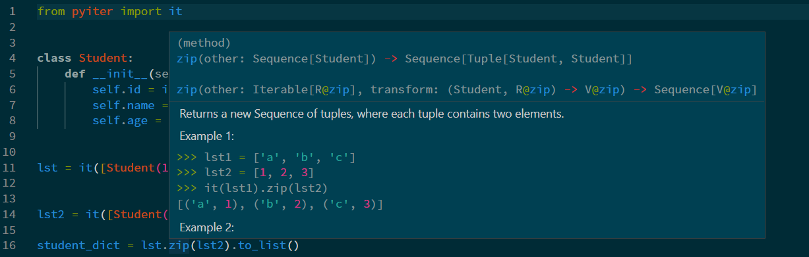

# PyIter

[](https://pypi.org/project/pyiter/)

PyIter is a Python package for iterative operations inspired by the Kotlin、CSharp(linq)、TypeSrcipt and Rust .
Enables strong **typing** and type inference for iterative operations.

- Chain operations like map, reduce, filter, map
- Lazy evaluation
- parallel execution
- strong **typing**

## Install

```bash
pip install pyiter
```

## Quickstart

```python
from pyiter import iterate as it

text = ["hello", "world"]
iterate(text).map(str.upper).to_list()
# ['HELLO', 'WORLD']
```

**Type inference**


## API

See [API](https://pyiter.yish.org/pyiter/sequence.html) docuumention.

- You no need to read api documention. all api functions are listed by the code completion as follows.
  
   

- All documentions are showed as follows.

   

## Similar libraries

Note that none of the following libraries are providing full strong typing for code completion.

- [Pyterator](https://github.com/remykarem/pyterator)
- [PyFunctional](https://github.com/EntilZha/PyFunctional)
- [fluent](https://github.com/dwt/fluent)
- [Simple Smart Pipe](https://github.com/sspipe/sspipe)
- [pyxtension](https://github.com/asuiu/pyxtension)