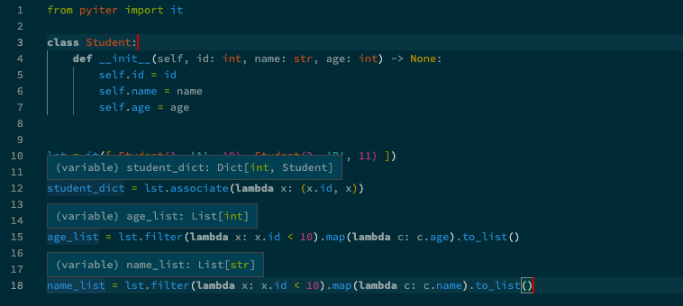

# PyIter

[](https://pypi.org/project/pyiter/)

PyIter is a Python package for iterative operations inspired by the Kotlin、CSharp(linq)、TypeSrcipt and Rust .
Enables strong **typing** and type inference for iterative operations.

- Chain operations like map, reduce, filter, map
- Lazy evaluation
- parallel execution
- strong **typing**

## Install

```bash
pip install pyiter
```

## Quickstart

```python
from pyiter import it

text = ["hello", "world"]
iterate(text).map(str.upper).to_list()
# ['HELLO', 'WORLD']
```

**Type inference**


## API

See [API](https://pyiter.yish.org/pyiter/sequence.html) docuumention.


